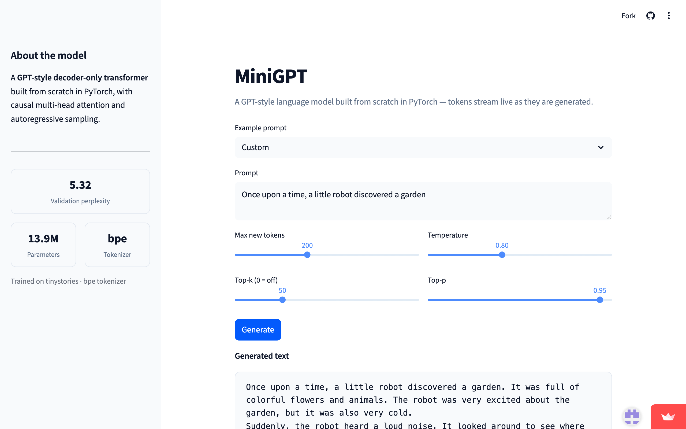
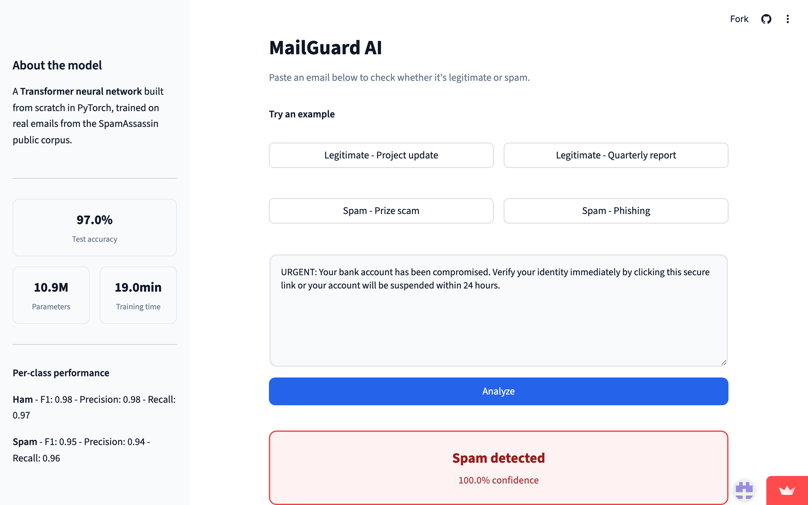
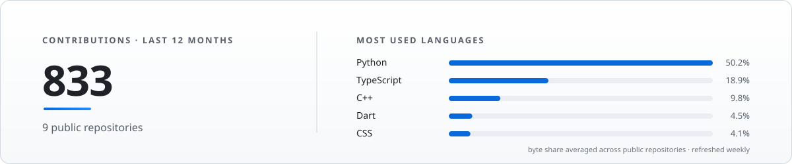

<picture>
  <source media="(prefers-color-scheme: dark)" srcset="assets/banner-dark.svg">
  
</picture>

[Portfolio](https://ilyes-jamoussi.github.io) · [LinkedIn](https://www.linkedin.com/in/ilyes-jamoussi) · [jamoussi.mail@gmail.com](mailto:jamoussi.mail@gmail.com)

> **I build ML systems from scratch — GPT and Transformer architectures in raw PyTorch, no `nn.Transformer`, no pretrained weights — and ship them like production software: typed code, tests, CI, Docker, live demos.**

Software Engineering @ **Polytechnique Montréal** (AI & Data Science concentration, Dec 2027) · Hybrid quantum-classical algorithms researcher @ **Calcul Québec** · ex-**AWS** Cloud Consultant Intern (ProServe)

<table>
  <tr>
    <th width="50%"><a href="https://minigpt-llm.streamlit.app">MiniGPT — live demo</a></th>
    <th width="50%"><a href="https://mailguard-ai.streamlit.app">MailGuard AI — live demo</a></th>
  </tr>
  <tr>
    <td></td>
    <td></td>
  </tr>
</table>

## Featured Projects

- **[MiniGPT](https://github.com/Ilyes-Jamoussi/minigpt-llm)** — decoder-only GPT trained from scratch in PyTorch on TinyStories: 13.9M parameters, byte-level BPE tokenizer, **5.32 validation perplexity**. Token-streaming inference over FastAPI (SSE), Dockerized, CI with ruff + mypy + pytest. [Live demo](https://minigpt-llm.streamlit.app)
- **[MailGuard AI](https://github.com/Ilyes-Jamoussi/mailguard-ai)** — encoder-only Transformer spam classifier built from scratch: padding-masked attention, custom 30K-token vocabulary, class-weighted loss on stratified splits. **97.0% accuracy, 0.95 spam F1** on SpamAssassin. [Live demo](https://mailguard-ai.streamlit.app)
- **[Poly Arena](https://github.com/Ilyes-Jamoussi/cross-platform-multiplayer-game)** — cross-platform multiplayer tactics game (team of 6): Angular web, Flutter mobile & Electron desktop clients on one authoritative NestJS + Socket.IO server; 4 game modes, visual map editor, AI players, **950+ unit tests**. Top contributor — **283/545 commits**.
- **[AVR Robot](https://github.com/Ilyes-Jamoussi/AVR-Microcontroller-Robot)** — autonomous line-following robot in C++ on ATmega324PA: **Dijkstra shortest-path navigation** stopping 10 cm from target posts; IR sensors, PWM motor control, I2C EEPROM, UART.

## Experience

- **Calcul Québec** (Researcher, Hybrid Quantum Algorithms · Summer 2026 — current) — developing hybrid quantum-classical algorithms in Python on **MonarQ, a 24-qubit universal quantum computer**, with GPU/CPU high-performance computing clusters.
- **AWS — Professional Services** (Cloud Consultant Intern · Summer 2025) — built an iOS/Android app replacing paper workflows for **100+ field technicians**, cutting reporting delays **from months to seconds**; architected the serverless AWS backend with offline-first sync (AppSync) and an **Amazon Bedrock (Claude 3.5 Sonnet)** documentation assistant.
- **Accenture — AI Strategy mandate** (Consultant, CCGP · Winter 2025) — designed a **RAG-powered chatbot** for a 10,000+ document portal, cutting navigation time by **75% for 1,000+ users**.
- **Polytechnique Montréal** — Teaching Assistant (Data Structures & Algorithms) · Team Lead of the peer-tutoring program.

## Stack

<table>
  <tr>
    <td><strong>Core AI / ML</strong></td>
    <td>
      
      
      
      
      
      
    </td>
  </tr>
  <tr>
    <td><strong>MLOps &amp; Serving</strong></td>
    <td>
      
      
      
      
      
    </td>
  </tr>
  <tr>
    <td><strong>Cloud — AWS</strong></td>
    <td>
      
      
      
      
      
    </td>
  </tr>
  <tr>
    <td><strong>Software Engineering</strong></td>
    <td>
      
      
      
      
      
      
      
      
      
    </td>
  </tr>
</table>

## Certifications

  
  
  

## GitHub Activity

<picture>
  <source media="(prefers-color-scheme: dark)" srcset="assets/stats-dark.svg">
  
</picture>
